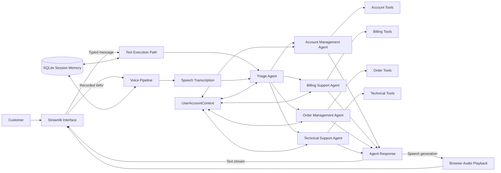
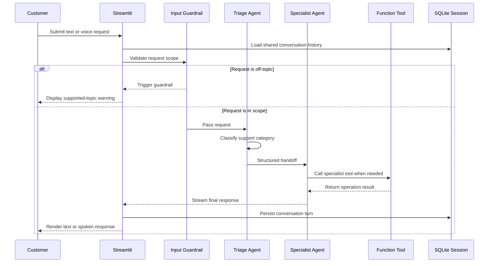
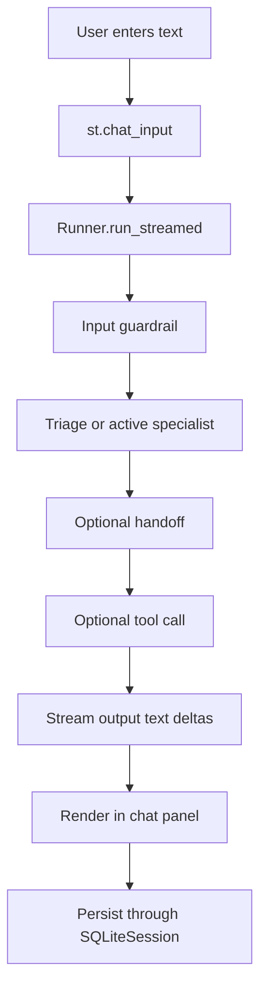
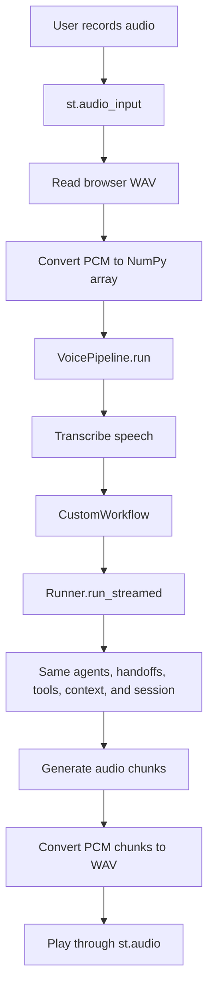

# Customer Support Agent

A multimodal customer-support application built with the **OpenAI Agents SDK** and **Streamlit**. The project provides text chat and browser-based voice messaging side by side, while a triage agent routes each request to a dedicated account, billing, order, or technical-support specialist.

The application demonstrates agent handoffs, typed context, function tools, input and output guardrails, persistent conversation memory, streaming text responses, speech transcription, and spoken AI responses in one coherent workflow.

> **Portfolio focus:** This repository is designed as an end-to-end example of how a multi-agent customer-support system can be organized, guarded, and presented through a user-friendly Streamlit interface.

---

## Table of Contents

- [Project Overview](#project-overview)
- [Problem Statement](#problem-statement)
- [Key Features](#key-features)
- [Application Preview](#application-preview)
- [System Architecture](#system-architecture)
- [Agent Workflow](#agent-workflow)
- [Text and Voice Data Flows](#text-and-voice-data-flows)
- [Agents and Responsibilities](#agents-and-responsibilities)
- [Tools by Specialist](#tools-by-specialist)
- [Guardrails and Safety Boundaries](#guardrails-and-safety-boundaries)
- [Session Memory and Shared Context](#session-memory-and-shared-context)
- [Streamlit Interface Design](#streamlit-interface-design)
- [Project Structure](#project-structure)
- [File-by-File Explanation](#file-by-file-explanation)
- [Technology Stack](#technology-stack)
- [Prerequisites](#prerequisites)
- [Installation with `uv`](#installation-with-uv)
- [Environment Variables](#environment-variables)
- [Running the Application](#running-the-application)
- [How to Use the Application](#how-to-use-the-application)
- [Example Requests](#example-requests)
- [Testing the Agent Handoffs](#testing-the-agent-handoffs)
- [Design Decisions](#design-decisions)
- [Current Limitations](#current-limitations)
- [Troubleshooting](#troubleshooting)
- [Security and Production Considerations](#security-and-production-considerations)
- [Future Improvements](#future-improvements)
- [Recruiter Summary](#recruiter-summary)

---

## Project Overview

This project implements a customer-support assistant that accepts either a typed message or a recorded voice message. Both interfaces use the same conversation memory, customer context, triage logic, specialist agents, and tools.

The application begins with a **Triage Agent**. The triage agent determines the primary intent of the customer request and hands the conversation to one of four specialists:

1. **Account Management Agent**
2. **Billing Support Agent**
3. **Order Management Agent**
4. **Technical Support Agent**

Each specialist has a narrowly defined responsibility and a dedicated set of function tools. The system also includes guardrails to reject unrelated requests and prevent the technical-support agent from crossing into billing, order, or account-management work.

The Streamlit UI intentionally places the text and voice experiences side by side. The microphone recorder appears at the bottom of the voice column rather than above the response panel, creating a more natural messaging experience.

---

## Problem Statement

Traditional support chatbots often rely on one large prompt that tries to handle every possible issue. That approach can create several problems:

- weak separation of responsibilities;
- inconsistent answers across support domains;
- accidental access to tools outside the current issue type;
- limited observability into routing and tool usage;
- disconnected text and voice experiences;
- loss of context between interactions.

This project addresses those problems with a multi-agent architecture. A triage agent classifies the request and transfers control to a domain-specific specialist. Each specialist receives only the tools and instructions relevant to its role, while both text and voice interactions continue using the same customer context and SQLite-backed session.

---

## Key Features

### Multimodal support

- Side-by-side **text chat** and **voice messaging** in Streamlit.
- Browser microphone recording through `st.audio_input`.
- Voice transcription, agent execution, and speech generation through the OpenAI Agents SDK voice pipeline.
- Spoken responses played directly in the browser with `st.audio`.
- Latest voice transcription displayed in the interface.

### Multi-agent orchestration

- Front-line triage agent.
- Four specialist support agents.
- Structured handoff metadata using a Pydantic model.
- Active specialist retained in Streamlit session state.
- Same agent workflow shared by text and voice requests.

### Persistence and context

- SQLite-backed conversation history.
- Shared customer profile and support tier.
- Activity log for agent, tool, and handoff events.
- Stored troubleshooting history.
- Reset control for clearing the conversation and returning to triage.

### Guardrails

- Input guardrail for detecting unrelated requests.
- Technical output guardrail for enforcing specialist boundaries.
- User-friendly handling of guardrail tripwires.

### Interface and developer experience

- Wide Streamlit layout.
- Fixed-height text and voice panels.
- Recorder positioned below the voice-response panel.
- Streaming text response rendering.
- `.env.example` and dependency file included.
- Modular Python files organized by responsibility.

---

## Application Preview

The interface is divided into three main areas:

- **Sidebar:** customer tier, active specialist, reset button, and agent activity.
- **Text support column:** persistent chat history and text input.
- **Voice support column:** transcription, generated audio response, processing status, and microphone recorder at the bottom.

```text
┌───────────────────┬──────────────────────────────────┬─────────────────────────┐
│ Support Console   │ Text Support                     │ Voice Support           │
│                   │                                  │                         │
│ Customer tier     │ Conversation history             │ Latest transcription    │
│ Active specialist │                                  │ Latest spoken response  │
│ Reset conversation│                                  │                         │
│ Agent activity    │                                  │                         │
│                   │ Text input at page bottom        │ Voice recorder at bottom│
└───────────────────┴──────────────────────────────────┴─────────────────────────┘
```

---

## System Architecture



### Architectural layers

| Layer | Responsibility |
|---|---|
| Presentation | Streamlit page, sidebar, chat history, voice recorder, browser audio playback |
| Orchestration | Triage classification, handoffs, active-agent tracking, streamed execution |
| Domain agents | Account, billing, order, and technical-support behavior |
| Tools | Simulated backend operations exposed with `@function_tool` |
| Guardrails | Off-topic input detection and technical-response boundary validation |
| State | Streamlit session state, typed customer context, SQLite conversation memory |
| Voice | Audio input conversion, transcription, agent response, and speech output |

---

## Agent Workflow



### Routing logic

The triage agent classifies each request into one primary category:

- technical support;
- billing support;
- order management;
- account management.

When the request is ambiguous, the triage agent may ask one concise clarification question. When the category is clear, it briefly explains the handoff and transfers the conversation to the appropriate specialist.

The currently active specialist is retained in `st.session_state`, allowing later turns to continue with that specialist rather than restarting from triage on every message.

---

## Text and Voice Data Flows

### Text message flow



The text path uses `Runner.run_streamed`. Raw text delta events are progressively added to a Streamlit placeholder so the customer sees the answer as it is generated.

### Voice message flow



The voice workflow does not create a separate support system. `CustomWorkflow` sends the transcription into the same multi-agent workflow and SQLite session used by text chat. The resulting text is converted into speech and played in the customer’s browser.

A SHA-256 hash of the uploaded audio prevents Streamlit reruns from processing the same recording more than once.

---

## Agents and Responsibilities

### 1. Triage Agent

**File:** `triage_agent.py`

Responsibilities:

- receives the initial customer request;
- applies the off-topic input guardrail;
- determines the primary support category;
- asks a clarification question only when necessary;
- performs a structured handoff;
- logs the handoff reason in the shared customer context.

The agent uses the OpenAI Agents SDK recommended handoff prompt prefix and removes prior tool context during a transfer with `handoff_filters.remove_all_tools`.

### 2. Account Management Agent

**File:** `account_agent.py`

Handles:

- login access;
- password resets;
- email changes;
- two-factor authentication;
- account data exports;
- account deactivation.

The instructions emphasize identity verification and prohibit requesting unnecessary secrets such as passwords or authentication credentials.

### 3. Billing Support Agent

**File:** `billing_agent.py`

Handles:

- payment failures;
- unexpected charges;
- invoices;
- subscriptions;
- refunds;
- payment-method updates;
- account credits.

The agent is explicitly instructed not to request complete card numbers, CVVs, passwords, or other sensitive credentials.

### 4. Order Management Agent

**File:** `order_agent.py`

Handles:

- order status;
- tracking;
- shipping;
- delivery issues;
- redelivery;
- returns;
- eligible shipping upgrades.

Premium and enterprise users can receive simulated premium shipping benefits.

### 5. Technical Support Agent

**File:** `technical_agent.py`

Handles:

- product errors;
- application crashes;
- setup problems;
- integrations;
- connectivity;
- performance issues;
- escalation to engineering.

The technical agent has an output guardrail that prevents it from performing billing, order, or account-management work.

---

## Tools by Specialist

All tools are defined in `tools.py` and exposed to agents with the OpenAI Agents SDK `@function_tool` decorator.

### Technical-support tools

| Tool | Purpose |
|---|---|
| `run_diagnostic_check` | Returns simulated product and infrastructure diagnostics |
| `provide_troubleshooting_steps` | Provides step-by-step guidance for connection, login, performance, crash, or general issues |
| `escalate_to_engineering` | Creates a simulated engineering ticket with priority and response expectations |

### Billing-support tools

| Tool | Purpose |
|---|---|
| `lookup_billing_history` | Returns simulated billing records for up to 12 months |
| `process_refund_request` | Creates a simulated refund request |
| `update_payment_method` | Initiates a simulated secure payment-method update |
| `apply_billing_credit` | Applies a simulated account credit |

### Order-management tools

| Tool | Purpose |
|---|---|
| `lookup_order_status` | Returns simulated order status, tracking, and delivery date |
| `initiate_return_process` | Creates a simulated return and determines the return-label fee |
| `schedule_redelivery` | Schedules a simulated redelivery date |
| `expedite_shipping` | Provides next-day shipping for eligible premium or enterprise users |

### Account-management tools

| Tool | Purpose |
|---|---|
| `reset_user_password` | Sends simulated reset instructions and a demo token |
| `enable_two_factor_auth` | Starts simulated 2FA enrollment |
| `update_account_email` | Starts a simulated email-change verification process |
| `deactivate_account` | Creates a simulated account-deactivation request |
| `export_account_data` | Creates a simulated customer-data export request |

### Tool activity hooks

`AgentToolUsageLoggingHooks` records:

- agent activation;
- agent completion;
- tool start;
- tool completion;
- handoff activity.

These events are stored in `UserAccountContext.activity_log` and displayed in the Streamlit sidebar rather than being written directly from asynchronous callbacks.

---

## Guardrails and Safety Boundaries

### Input guardrail

The input guardrail uses a dedicated model-driven agent to decide whether a request belongs to the supported customer-service domains.

Allowed examples include:

- greetings;
- account questions;
- billing issues;
- shipping or order requests;
- technical problems.

Clearly unrelated requests trigger `InputGuardrailTripwireTriggered`, and the UI explains which topics are supported.

### Technical output guardrail

The technical-support agent’s final output is evaluated by another dedicated guardrail agent. It flags responses that improperly perform:

- billing actions;
- order or shipping actions;
- account-management actions;
- unrelated work outside technical troubleshooting.

A technical agent may recommend contacting another specialist, but it should not complete that specialist’s task itself.

### Why this matters

These boundaries reduce tool misuse and make the multi-agent design easier to reason about. In a real production environment, these model-based guardrails should be combined with deterministic authorization checks, backend validation, human escalation rules, and audit logging.

---

## Session Memory and Shared Context

The project uses two complementary forms of state.

### SQLite conversation memory

`SQLiteSession` stores the ongoing conversation in:

```text
customer-support-memory.db
```

The text and voice paths both reference the same `SQLiteSession`, allowing the conversation history to remain consistent across modalities.

### Typed customer context

`UserAccountContext` is a Pydantic model shared with agents and tools.

It stores:

- `customer_id`;
- `name`;
- `email`;
- customer `tier`;
- troubleshooting history;
- agent and tool activity history.

It also provides helper methods for:

- checking premium eligibility;
- appending troubleshooting steps;
- adding timestamped activity entries.

The sample application initializes the context with a demonstration customer named Derek. Replace this hardcoded context with authenticated customer data before using the project in production.

---

## Streamlit Interface Design

The Streamlit application is configured with a wide layout and two primary columns:

```python
text_column, voice_column = st.columns([1.65, 1], gap="large")
```

### Text column

- Displays SQLite-backed user and assistant messages.
- Uses a fixed-height container for a stable chat area.
- Uses `st.chat_input` for new requests.
- Streams model output into an `st.empty()` placeholder.

### Voice column

- Displays instructions, the latest transcription, and the latest generated audio reply.
- Uses a fixed-height response panel.
- Places `st.audio_input` **after** the panel, keeping the recorder at the bottom.
- Shows a processing status while transcription, routing, tool usage, and speech generation occur.

### Sidebar

- Changes the sample customer tier between basic, premium, and enterprise.
- Displays the current active specialist.
- Clears the SQLite session and local state.
- Shows the latest agent and tool activity.

### Why browser audio playback is used

The application uses `st.audio` instead of a server-side audio library. This is important because Streamlit applications may run remotely. Server-side playback would play sound on the machine hosting the application rather than on the customer’s browser.

---

## Project Structure

```text
customer-support-agent/
├── main.py                   # Streamlit UI and text/voice entry points
├── workflow.py               # Custom voice-to-agent workflow
├── triage_agent.py           # Routing agent, input guardrail, and handoffs
├── account_agent.py          # Account specialist definition
├── billing_agent.py          # Billing specialist definition
├── order_agent.py            # Order specialist definition
├── technical_agent.py        # Technical specialist and output guardrail attachment
├── tools.py                  # Specialist function tools and activity hooks
├── output_guardrails.py      # Technical response boundary validation
├── models.py                 # Shared Pydantic context and structured outputs
├── requirements.txt          # Python dependencies
├── .env.example              # Environment-variable template
├── README.md                 # Project documentation
└── customer-support-memory.db# Created locally after the app runs
```

Generated files such as `.venv/`, `__pycache__/`, `.env`, and the local SQLite database should normally be excluded from Git.

---

## File-by-File Explanation

### `main.py`

The application entry point. It:

- loads environment variables;
- configures the Streamlit page;
- applies custom UI styling;
- initializes Streamlit session state;
- creates the SQLite session and sample customer context;
- renders conversation history;
- streams text responses;
- converts browser-recorded WAV audio into PCM data;
- runs the voice pipeline;
- reconstructs generated PCM chunks into a WAV response;
- maintains the current specialist agent;
- catches guardrail and runtime errors;
- displays the text and voice features side by side.

### `workflow.py`

Defines `CustomWorkflow`, which extends `VoiceWorkflowBase`. It receives a transcription, sends it through `Runner.run_streamed`, yields text to the voice pipeline, and stores the last active agent.

### `triage_agent.py`

Defines:

- the input guardrail agent;
- the `off_topic_guardrail` function;
- dynamic triage instructions;
- structured handoff logging;
- handoff configurations for all specialists;
- the main `triage_agent` object.

### `models.py`

Defines the typed models used by the system:

- `UserAccountContext`;
- `InputGuardrailOutput`;
- `TechnicalOutputGuardRailOutput`;
- `HandoffData`.

### Specialist agent files

`account_agent.py`, `billing_agent.py`, `order_agent.py`, and `technical_agent.py` each define:

- dynamic instructions based on the current customer context;
- the tools allowed for that specialist;
- an agent name and handoff description;
- shared activity hooks.

### `tools.py`

Contains all demonstration backend actions. Tool functions receive a `RunContextWrapper[UserAccountContext]`, allowing each action to read customer data, apply tier-specific behavior, and log activity.

### `output_guardrails.py`

Defines the technical output-review agent and its output guardrail. The guardrail returns a structured validation result and triggers when the response crosses specialist boundaries.

---

## Technology Stack

| Technology | Role |
|---|---|
| Python | Core application language |
| OpenAI Agents SDK | Agents, handoffs, tools, sessions, guardrails, streaming, and voice pipeline |
| Streamlit | Browser-based user interface |
| Pydantic | Typed context and structured agent/guardrail outputs |
| SQLite | Local persistent conversation memory |
| NumPy | PCM audio-array processing |
| `wave` | WAV parsing and generation |
| `python-dotenv` | Local environment-variable loading |
| `uv` | Fast Python environment and dependency management |

---

## Prerequisites

Before running the application, install:

- Python 3.11 or newer;
- `uv`;
- an OpenAI API key;
- a modern browser with microphone permission enabled.

The code was organized for a local development environment. A virtual environment is strongly recommended.

---

## Installation with `uv`

### 1. Clone the repository

```bash
git clone <YOUR_REPOSITORY_URL>
cd customer-support-agent
```

### 2. Install `uv`

macOS and Linux:

```bash
curl -LsSf https://astral.sh/uv/install.sh | sh
```

Restart the terminal after installation if the `uv` command is not immediately available.

### 3. Create the virtual environment

```bash
uv venv
```

### 4. Activate the environment

macOS and Linux:

```bash
source .venv/bin/activate
```

Windows PowerShell:

```powershell
.venv\Scripts\Activate.ps1
```

### 5. Install dependencies

```bash
uv pip install -r requirements.txt
```

The main dependencies are:

```text
openai-agents[voice]
streamlit>=1.40
python-dotenv>=1.0
numpy>=1.26
pydantic>=2.0
```

---

## Environment Variables

Copy the environment template:

```bash
cp .env.example .env
```

Open `.env` and add your API key:

```env
OPENAI_API_KEY=your_openai_api_key_here
```

Do not commit `.env` to GitHub.

A recommended `.gitignore` entry is:

```gitignore
.env
.venv/
__pycache__/
*.py[cod]
customer-support-memory.db
.DS_Store
```

---

## Running the Application

From the project root, run:

```bash
uv run streamlit run main.py
```

When using an already activated virtual environment, this also works:

```bash
streamlit run main.py
```

Streamlit will display a local URL, commonly:

```text
http://localhost:8501
```

Open the URL in a browser and allow microphone access when prompted.

---

## How to Use the Application

### Text support

1. Enter a request in the chat input.
2. The guardrail verifies that the request belongs to a supported domain.
3. The triage agent selects the appropriate specialist.
4. The specialist may call a relevant tool.
5. The response streams into the text conversation.
6. The conversation is stored in SQLite.

### Voice support

1. Select the microphone recorder at the bottom of the voice column.
2. Record and submit a message.
3. The app converts the uploaded browser WAV into a NumPy PCM array.
4. The voice pipeline transcribes the recording.
5. The transcription enters the same agent workflow used by text chat.
6. The generated answer is converted into spoken audio.
7. The transcription and response audio appear in the voice panel.

### Changing customer tier

Use the sidebar to select:

- basic;
- premium;
- enterprise.

The customer tier changes agent instructions and selected tool behavior, such as expedited shipping eligibility and expected escalation response time.

### Resetting the conversation

Select **Reset conversation** to:

- clear SQLite session items;
- return the active agent to triage;
- remove the latest voice output and transcription;
- clear activity and troubleshooting logs.

---

## Example Requests

### Account management

```text
I forgot my password and need a reset link.
```

```text
Help me enable two-factor authentication using an authenticator app.
```

### Billing support

```text
I was charged twice this month. Can you check my billing history?
```

```text
Please submit a $29.99 refund because the service was unavailable.
```

### Order management

```text
Where is order ORD-10492?
```

```text
I need to return the headphones from order ORD-10492 because they arrived damaged.
```

### Technical support

```text
The application crashes every time I upload a CSV file.
```

```text
The dashboard is loading very slowly. Run a diagnostic and give me troubleshooting steps.
```

### Guardrail test

```text
Write me a poem about space travel.
```

The request should be blocked because it is outside the supported customer-service scope.

---

## Testing the Agent Handoffs

Use the following sequence to observe routing and session behavior:

1. Start with an order request:

   ```text
   Check order ORD-1001.
   ```

2. Confirm the sidebar shows **Order Management Agent**.

3. Continue with a related follow-up:

   ```text
   Can you schedule redelivery for Friday?
   ```

4. Reset the conversation.

5. Submit a technical request:

   ```text
   The mobile application keeps crashing after login.
   ```

6. Expand **Agent activity** to see agent activation, tool use, completion, and handoff events.

To test modality continuity, send a text request first and then submit a related voice follow-up. Both should use the same SQLite session and current specialist.

---

## Design Decisions

### Separate agents instead of one universal support prompt

Each specialist receives a limited instruction set and only the tools needed for its domain. This improves maintainability, observability, and control.

### Dynamic instructions

Agent instructions are functions rather than static strings. This allows the application to personalize behavior using the customer name and support tier at runtime.

### Shared text and voice workflow

The voice feature does not duplicate agent logic. `CustomWorkflow` reuses the same runner, context, session, handoffs, tools, and guardrails.

### SQLite session persistence

A local SQLite database provides a simple demonstration of durable conversation history without requiring an external database service.

### Tool hooks write to context, not Streamlit

Asynchronous SDK hooks should not directly manipulate Streamlit UI components. Instead, hooks record activity in the typed context, and the synchronous UI renders those entries safely.

### Recorder placement

The voice response area is created first and `st.audio_input` is rendered after it. This intentionally positions the voice recorder at the bottom of the voice section.

### Browser playback

Generated audio is returned as WAV bytes and rendered with `st.audio`, ensuring playback occurs in the user’s browser rather than on the application server.

---

## Current Limitations

This repository is a demonstration project rather than a production customer-support platform.

- Tool results are simulated and often randomly generated.
- No real billing, order, identity, CRM, or product database is connected.
- The sample customer profile is hardcoded in `main.py`.
- Authentication and authorization are not implemented.
- Sensitive actions are simulated without real identity verification.
- The SQLite session uses one fixed demonstration session ID.
- Multiple concurrent users would require unique session and customer identifiers.
- Voice history displays only the latest transcription and latest generated audio reply.
- The audio conversion expects 16-bit PCM WAV input.
- Model, transcription, and speech settings are currently left to SDK defaults.
- No automated unit, integration, or end-to-end tests are included.
- No human-agent escalation dashboard or ticketing integration is implemented.
- The local SQLite database is not intended for horizontally scaled deployment.

---

## Troubleshooting

### `OPENAI_API_KEY` is missing

Confirm that `.env` exists in the project root and contains:

```env
OPENAI_API_KEY=your_actual_key
```

Then restart Streamlit.

### `ModuleNotFoundError: No module named 'agents'`

Install the Agents SDK with voice extras:

```bash
uv pip install "openai-agents[voice]"
```

Or reinstall all requirements:

```bash
uv pip install -r requirements.txt
```

### `streamlit: command not found`

Run through `uv`:

```bash
uv run streamlit run main.py
```

Or activate the environment first:

```bash
source .venv/bin/activate
```

### Microphone control does not work

- Allow microphone permission in the browser.
- Use `localhost` or an HTTPS deployment.
- Confirm the browser supports microphone capture.
- Reload the page after changing browser permission.

### Voice request fails with a WAV or PCM error

The current converter expects 16-bit PCM WAV audio. Confirm that the audio comes directly from Streamlit’s `st.audio_input` rather than an arbitrary uploaded media file.

### Audio response is not audible

- Confirm the browser tab is not muted.
- Increase the system volume.
- Confirm the response audio widget appears.
- Review the Streamlit terminal for API or voice-generation errors.

### The same recording is not processed again

This is intentional. The app hashes each recording to prevent duplicate execution after a Streamlit rerun. Record a new message or reset the conversation.

### Old conversation messages remain

Select **Reset conversation** in the sidebar. If necessary, stop the app and remove the local database:

```bash
rm customer-support-memory.db
```

### An unrelated request is blocked

The input guardrail only permits account, billing, order, shipping, and technical-support conversations, along with brief greetings.

### A technical response is blocked

The technical output guardrail may have detected billing, order, or account-management content. Rephrase the request or reset the conversation so the triage agent can route it to another specialist.

---

## Security and Production Considerations

Before adapting this project for real customers, add the following controls.

### Authentication and authorization

- Authenticate every customer.
- Load customer context from a trusted identity service.
- Authorize each tool operation independently.
- Require step-up verification for sensitive actions.

### Data protection

- Do not place full payment details, passwords, tokens, or secrets into prompts.
- Encrypt data in transit and at rest.
- Apply data-retention and deletion policies.
- Redact sensitive data from logs and traces.
- Store API keys in a managed secret store.

### Backend integrations

- Replace random demonstration responses with validated API calls.
- Add idempotency keys for refunds and account actions.
- Validate all model-generated tool parameters.
- Require confirmation before irreversible actions.
- Add transaction-level audit trails.

### Agent safety

- Use deterministic policy checks in addition to model-based guardrails.
- Apply rate limits and abuse detection.
- Define escalation conditions for high-risk or uncertain requests.
- Add human review for refunds, deactivation, and sensitive account changes.
- Test for prompt injection and indirect instruction attacks.

### Deployment architecture

- Use an external database for multi-user persistence.
- Assign unique session IDs per authenticated customer.
- Add structured application logging and monitoring.
- Separate frontend, orchestration, and backend-service credentials.
- Configure HTTPS and secure browser microphone access.

---

## Future Improvements

### Product and UX

- Add a full voice conversation timeline rather than only the latest turn.
- Display routing and tool events in a polished trace panel.
- Add customer profile editing and account verification screens.
- Support file uploads, screenshots, and order documents.
- Add multilingual text and voice support.
- Add interruption and real-time streaming voice conversations.
- Add accessibility improvements and mobile-responsive layouts.

### Agent architecture

- Return completed specialist conversations to the triage agent when the topic changes.
- Add sentiment and urgency detection.
- Add a supervisor agent for complex multi-domain cases.
- Add confidence thresholds before tool execution.
- Add structured case summaries for human handoff.
- Add knowledge-base retrieval for policy and product documentation.

### Backend integration

- Connect to a CRM such as Salesforce or HubSpot.
- Connect to payment, subscription, and invoice APIs.
- Connect to an order-management and shipping platform.
- Connect to real observability and diagnostic services.
- Connect engineering escalations to Jira, Linear, or ServiceNow.

### Engineering quality

- Add `pyproject.toml` for complete `uv` project management.
- Pin dependency versions for reproducible builds.
- Add linting with Ruff and static checking with mypy or Pyright.
- Add unit tests for every function tool.
- Add handoff and guardrail integration tests.
- Add Streamlit end-to-end tests.
- Add CI workflows for tests, linting, and security checks.
- Containerize the application with Docker.
- Add deployment instructions for Streamlit Community Cloud or another hosting platform.

---

## Recruiter Summary

This project demonstrates practical experience with:

- designing a multi-agent system with clearly separated responsibilities;
- implementing agent-to-agent handoffs with structured metadata;
- creating context-aware agent instructions;
- exposing Python functions as model-callable tools;
- applying input and output guardrails;
- streaming model responses into a frontend;
- integrating text and voice interactions into one workflow;
- processing PCM and WAV audio in Python;
- maintaining persistent conversation memory with SQLite;
- managing application state in Streamlit;
- designing a user-facing support console with agent observability;
- recognizing the security, authorization, and infrastructure work needed to move an AI prototype toward production.

The repository is intentionally modular so each agent, guardrail, tool group, UI component, and workflow can be understood and extended independently.

---

## License

Add the license that best fits your intended use before publishing the repository. For a public portfolio project, the MIT License is a common option.

---

## Author

**Gihyun Derek Kim**

Built as part of an AI Agents portfolio using the OpenAI Agents SDK, Streamlit, Python, Pydantic, SQLite, and browser-based voice interaction.
